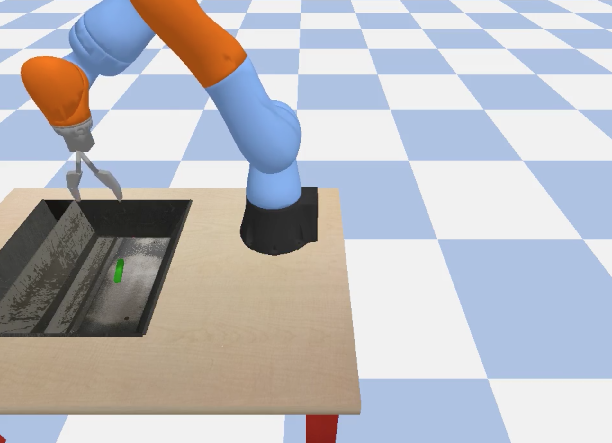

# Reinforcement Learning with [tensorflow/agents](https://github.com/tensorflow/agents)

Here we provide a demonstration of training a reinforcement learning agent to perform a robotic grasping task using Kubeflow running on Google Kubernetes Engine. In this demonstration you will learn how to paramaeterize a training job, submit it to run on your cluster, monitor the job including launching a tensorboard instance, and finally producing renders of the agent performing the robotic grasping task.

For clarity and fun you can check out what the product of this tutorial will look like by clicking through the render screenshot below to a short video of a trained agent performing a simulated robotic block grasping task:

[](https://youtu.be/0X0w5XOtcHw)

### Setup

##### GCP and Kubeflow configuration

This tutorial assumes you have deployed a Kubernetes cluster on your provider of choice and have completed the steps described in the [Kubeflow User Guide](https://github.com/kubeflow/kubeflow/blob/master/user_guide.md) to deploy the core, argo, and nfs components.

##### Launching

This example is intended to be run inside of the `gcr.io/kubeflow/tensorflow-notebook-cpu` container running on JupyterHub which is in turn running on Kubeflow. You may provide the name of this container via the spawner options dialog.

For general troubleshooting of the spawning of notebook containers on JupyterHub or anything else related to your Kubeflow deployment please refer to the [Kubeflow User Guide](https://github.com/kubeflow/kubeflow/blob/master/user_guide.md).

Once the notebook is launched the only setup step that is required is to use git to obtain the source code of the example which you can do as follows (from within the tensorflow-notebook container):

```bash
cd /home/jovyan
git clone https://github.com/kubeflow/examples kubeflow-examples
```

The demonstration notebook can then be accessed via /home/jovyan/kubeflow-examples/agents/doc/demo.ipynb.

Well it looks like our initial setup is finished 🎉🎉 and it's time to start playing around with that shiny new demonstration notebook!!

